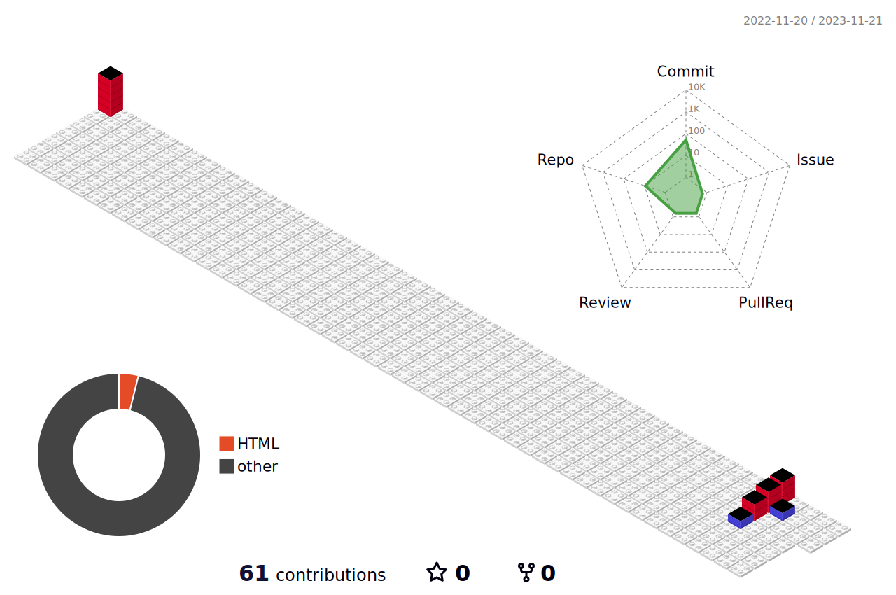

<!-- <h2 align="center">Hi 👋! My name is Can and I'm a Front-end Developer with React skills</h2> -->
<!--

-->

### 

###

<!--
###

  
  

-->

###
 

<h2 align="center"> My projects</h2>

###

  Project Demo       |Libraries and Technologies I use     |Project Preview   
:-------------------------|-------------------------|-------------------------
<!-- [React Typescript Chat App](https://dev-chat-rosy.vercel.app/) <h3>[Repo](https://github.com/canocalir/dev-chat)</h3> | ReactJS, Redux Toolkit, Firebase, TypeScript, Styled Components | -->

 
<h2 align="center">My Tech Stack</h2>

###

<img align="right" height="150" src="data:image/jpeg;base64,/9j/4AAQSkZJRgABAQAAAQABAAD/2wCEAAoHCBINEhISEhIPEhIMDw8PDw8KDxEJChAZJSEnJyUhJCQpLjwlKSw4LSQkKzo0ODE1NzdDKDE8WUg1PzxCNzUBDAwMEA8PGBESGDEdGh4xMTQ/MT80NT8/NDExND80PzExPzQxMT8/ND8/Pz80Pz84Oj80Pz89NDQ/PzExNTE0NP/AABEIAMgAyAMBIgACEQEDEQH/xAAcAAABBAMBAAAAAAAAAAAAAAAAAQIDBQQGBwj/xAA2EAACAQIEAwUHAwQDAQAAAAABAgADEQQSITEFBkETIlFhcQcycoGRobEUQlIzYsHwI9Hhgv/EABoBAAIDAQEAAAAAAAAAAAAAAAABAgMEBQb/xAAnEQADAAICAgEEAQUAAAAAAAAAAQIDERIhBDFBBRMiUWEUMnGRsf/aAAwDAQACEQMRAD8A6EFEMohFhsgFhFAiRTAkOhG3joERLRcoMXNARgN7MRcsUQjATs4gp2kl4AwAYUgKceY4GC2IjyGKEMkvAGMCJlMAh/ElaKDEMjIPhEtJhCPYiMCLa8kEWHICPKYASSEWxkNbVW+FvxCSVR3W+FvxCMDDiwhIIAjogEDAAELxIojABpHrGgRRABTEgdYh0jEOjhGiLtAYsWJeKI0wCOAjY+ABaEIAwIiiELwUwGOhC8LwGEICLABtX3G+FvxCJW91vhb8QgBi2jatRUF2IUDcsQojMU7LTYpYsqkqDsTONcZ4xicQ5FV27pIyDuIJTV8TZ4nivPvvSR0jH834WgcobtDc/wBPvCY+C5pFZ/2qmuh96csD2/3WS0MUwOkp+5R1V9PxKdL2d0oVVqKGU3DWks53ynzJUV1pvqjWUNoMpnRLggEdZfFcls43k4Kw1p+hRAwAgZYZxAYsSKoiAIR1oBYwFEUCEUQQAI68aI4CMQQMIXgILRQYgMVYhgDFgIsBgIsQRY0Ayv7r/A34hCt7rfA34hADl2C5/ZFtUplzrlZTaapx/iiYmoai0xTzbjQzCuJGaec72mPe/Z6acMw24XbIhWmTTYHaMWgLx+QLtE+PwWwrXbMzD1chBuflcTofJvMXbH9PUPeUf8bEklxOYZjMzD1npsjobMhBVhoYTTli8jBOaNP2d4EQiVHLXFhjaKsbCooCuvW8uJrT2tnl8kOKc17QyPAtEMURkQgJg8S4vh8EM1eqlMaAGobTW+J+0bA0AezqCsQCQKV9dtNvP7GAG5RlfE06Kl6joiru1RhTQfMzinFvadja5YUcmHQ+7kQVa9vU6faahicfWrktUqVKhLFiartU18dYINHpbCcRo4gXp1EqA7GmwcGZd55kwfFq2HuKdQqDY2sGsfEX2M27l/2jYygypWIxFM2X/kASsv8A9Df5xi0dtif+ys4Jx3D8QDGhUDmmVDrlKMt/X0MtIgACOAiAxbxjAGEQbx1ogAQgICMBtb3W+FvxCFUd1vgb8QgB5tOwMVXIuBEsLQKZbTL0ejXL2ianUjxrMPORMqiwMhU/JfiycvxZMqx5bL6RAbRGN5A1666Ng5Y4+2CqKd6dQgONyB4zrlGoKihlIIYAqRqJwSih+U6LyBxg2/TVDe39Ik6+kux1p6ZyPqPicp+7K7Xs3m0wOO8VTh2HqYipfLRW+VbZnJ0AHqZZWnOvbMjnCUCt+zGJGe17e6bX+81HBOT8b4tUx9d69QkmoxKrclVHRR5CYIjRrJES8hsloQCPVf8AeszMNgy1hY6/Sbly7ymuIszC4FtDdbyus0yXz49Ut+kaEQfCOSoUIYaFTedU49yMKlMGiFV0B0tlD6TllekyOyMCGQkFWBVgZKMnL0V5MfE6D7NeKp26IDkqVG771HJFQW0UDb/2djAnm/lXF/pcZhambKEroHJ2yk2b7Ez0ku0t0U6EgY6FohhAm0LRCguD1F9YwFBhFtFtACOr7rfC34hHVfcb4W/EICPN64c9Y84UnW+kntJU90i28wcmz2CwylornoW21iKCsy2HlGuhMkq/ZCsKXciI95KomMqkGZiGRZbiptaY6lpM/DYpqDrUpmzIQwMr2fwjqD6i+19YJltJNafo7Ty9xZMdRWoCM9gHX9ymM5qwyVsFi1ZQy/pqzWbxCkg/USh5L4M9O1cOFSoosqa5x5zcMTRFWm6NqtVGRhtoRYzZDbns8j5cTGalL2jy3STr4zJpJqJJjMKcPUqUm96hUek19NQbf4jUaQoeNI2PhGHzkDpcCdR4HRWkgGl9NN5yrhOMKEAb3FhOo8EpsEDufesbeE59TXM6mRr7S0zaKVIMBpvacW9qPCVwuNLp7uJRahHS40P4nb8Abi80X2q8vvXoHEoVP6a7MrDvZTvb7TowtJM5NvbaOLT0hytiTXwWEqMbtUw1FmPicovPPXD8E2Lq06KaNWdULWuFBOpt5T0By5SXCp+hBZjw9Ka9o9gHDC4MsqltIrUNptL0XQjHxKKbE2I+kc7BASbCwOp2ms42rqzg3zHzKxU9E8OH7j0zZ6VQP7pB9JIUI6f5mq8Kxb0iLC5dwLnwmx4bHgklyAA7IDsto5e0Sy+PUvrsmGkcJGuIWrYrb06x+8ZnqWnpjavuN8LfiEKvut8LfiECJwTHYbI9ha3SxvaWfBOyWnWVyudkXIallA8Zr+L4oNFUXI6zCr1Cw3Nz4aCY1L2esyZ5ctJ7aLTEuisyAqQGIuLG8Yig9ZTp5yenUKwqBY/K5e0ZlReoiKYCpmG0Y6mQ/hmhvX5ImSxkqACYqScPDRKa37No5d5qqYBTTK9pTJuFYkFfSXL8/VD7tJB8TEzQVaODXjWSl0V14WC65Uu2YnOeOXE4o1ggRqyIagT3WYaX+gEpaNRTubecs+N0syhuq6X8pSMhBvqPvNEvlPZwPLx/ZzNSui4oO9Ngaal7a6KXWZVfmrFmy9pkC2/p3LTdfY+or08XRcXV0C30zAEWMpOPcjfoKndqrUUksEqqUcj5b/aQbUrbEuVtTLN45I48ayIjVqrVGAYHEUDSpsPIzesTRWvTam4DK6lWU95TOfcscQeqEpJTFNKSgd21NfpOhYZSFF/KSx5OW0ivPjeOlv2cT4fwCtgMXi6iZC3C6ZxCLW1zqTbbr3c3ztN64Nxk1KS4o0wHxIFNrEhSqk2P3t8pc8zYNHouwpq1SrkQXAUvZrhSfC4vbrKLFslMqihcqAZsnuBrC4HkLASNb5d/BqwTNxrXtlpieJivTKWylvePQSvNI1bIDottesgyh/IeGwlhwynlN/KWey3hONfiT06WUra3dtp0mQtMt3f5EtaSIBe/U7CZ+AoXJJ3EslGW8mlshTh+VbgkEa+EkSodNb238ZY1CFBvsAdJWK2aop2DbjrGZk+W9hiMbTUEOwQkEAOQoMJqntHIXIFvmVWPc0tfxhIOuzbh+nTlhX+zjaIN+sc66H5+syaGGLb6TOSiqi2W58eszu1s6WPxqc/ooaakbgj1uJMus2zi1OnUp0u4oPZgEgWIM1ZEKkjwJhy32QWFzoyMMsyCt5FR7slUyqn2dDEkpSY007QsZOusbUGkSoscL2iNRJFBiIJMBeS6BJmDxOmTTPyMpOxO82momYEHYgiUVclMykai4lkV8I4/1HB+St+jonsYbL+pG1yh10EzfaNSc00xWdS1CoabJTOY5DsT8x95zLhHGsTgi3Y1mp9opDAZXU/WdI5c47TxFNKdZ+0ZkKVKSp2of1ElX6Zjw7b5T8FhyBj6ddNLZha40BnREYWsPCcPqU6nC+I03oUa9HD4ioqItchqbgnUaE28gdZ2jCtcA+Qjw/jtIp8l8nyZU854X9Rg2pg2vVwzE7aB1J/E19UBYDp1M3Di9M1KNQDooP0N5qNCmQL30+8nS7NHiNcWTMhDDS4bpvaWeGolReQYejciWFNSTYa3sJKZHlv4G0Bc6Hf6y3wlPLexNvPa8io4ULcgXNrSem5AsRaTSMWSuXSIse+Vb312EqUxXZk1D0BOukzMS+drg3y62/bKHiQzXGYgLYkHRT5RU9F/j401plPxNDj3Z2c3YEAAlLgbCERgdf7QSCNGhKvfZ1FThan0aRRp+Q1mRSspJPgfAmQUjcgHY9dpP7hIZQ1xoQdBMknUf6Mt8QTRv/BiLkAm01qpZnJHU/KZ+JxbIjUxrnI+UwKaSbejPS70iVBJAsRFkqiQ2XzIm0VheObWOAjJpEarJUW0jrYhKIuzBR06sZV1OYcpIVARrYsSCflHMNmfL5eHC9U+y6cdfCVHGBT0bMoYbqSASJWYjjFap+7KPBBlmASTqbknqdTLpxaezleX9SnJLmZ3/kylUdZvHIOLCO1qYJ0Ga1yJouHNxr0m6clYtKFSxUkvYLsFhl6Rh8etNnWcNhhiaRFZFYMQ6hhcqRsfWWWEJAtrpYa7zDwbl1F7AW2U3lnh0v6RR8NFeSvezLRO6Qf3AzVuNYU4VTUSnUqIpJZMOBUqoPEDqPTWbXm0lZxfH08JSqV6jBUoqWY/4+ctorxXUvopeD8Sw+NTNRqJUtbMqm1RPUbiX2DonS4GpJv1nmgcSqLXfEU2ak7VHqA0iUy3N7ek6Xyv7VsuWnjUuNB+pw473qy/9fSXJdDvLy6OvqthaYuKI2HpIuGcXw+Op9ph6qVFO5pt3l9RuPnG111tc+MRXjXeytxw7IHKSSfmJqeJSozEnNqxNgTNpxpub9Be3jK1E0OlvPeVV2zr4HxnbKLO4DX07p26wmdi3FIEFQbqdDY2iyGjS++9GiPSC2sd4ysbDrt6yVGuLWvpvLjlrBrXq5agBGQ+dpnXb6OlkpRLp/BqjJm3iilabvzFwajgaDVFuSSAAZpFOqXNrbyVTr2U4c0ZFykkVJIqGSIlpIgvK96Niki7MzFx+KGHTMdSdFXqTLHEOtNCzGwUEm80jH4tq7ljtsq9AJdE8mc/6h5f2I1P9zIsRXaqxZiST9BIrRyCE0qTy9W6rb7YloWi2hJaIj6L5D5dZdYI7FCQdNjYyimThcW1Ig7gdNpVccvRdiyKa79HWuVOKVNFqEkad5tTOjYWoSo9BOI8G5qwyZe0zpltoEzr9pdcR9pyZMmHV10tnZRn+QmeJuae0aMtRbWmjo/FeYKOE0eoAf4jvP8ASce5+5wbibChTzLQpHM+oLVG8/Sa9xLjtTEE2uoYks2YvUb1MrNppxzTe6/0UZKiVxnv+Rb2iXhGNNGzMZmB4hUwzh6VR6dRSCr0mKNOg8B9qFVO5jKYrLawqUrUqw9RsftOYiSo1oLv2OaaO/YHjVHHJno1FfTVLhaieo3g7N0BAb6zjfL3E2wNenVFzlYB12zodxO6YSumJWnUpi6VUBRrdJXePR0cOdUvXorcXwwMl84JZTcAag+EJdHht2OuoR2Y6kAwkOJP+q11s5py7wZ8c+RCAFALsbkLNz4fyw2BqdoHNRQDmW3el7yzwFOHUQgsXbV36kyzNE6m/wAooxyl2LyvqFZLcy/x/wCnKueuOUcRTFGm3fVxnUqUZbTUMAQra9RYTrvMvKNHiN2CrTrDaoqgE+s5hxLg1XA1MlUWO6suquPESGaNdo6H03LDXFeyVUBklOkJi0CRMLjvFewTKnvuCNN1HjKJnfR1s+acUO2+kVfMvEAzdkhuqnvEagnwlDA66nc31O8JrieK0eO8jPWbI6fyEIQkygItoCLaMiJaFo4CEAEtFhFgACLeJASQDolo4CKBACNRcn+25jk1I8F1Mcg0c+FolMWU/wBzBflGBkUjrr1nT/Zfx/sqn6SobrWu1Esb5HA1HzH485y6nq9v4i58Ja4Os1O1RGK1KTK6MNwQZYlyTCa40ejcwyVGOmZWAJ22hMDhvE1x2ESsmi1qVyundNrEfW8JTov6L+14xzlBMAx30kLtc67Dp0kUimZYxUdmvsPHaYPHeC0uIpkfuuhJR1sHUy4RgYj0w2ux8RvB99MsnJUUql6aOR8Q5efBtkfUH3XAOVhNP5v4I62xCKzIoC1SqlgngZ6HxWESupSooYHx39ZUJwNKKOlu0SoCGFRQ9wehlSjVdejpZPPWbA4tfkeX4S75v4cmCxlenSv2avdAdct9bfKUkt9nKaafYQhCACxwjRHCMiLCBhGAQiRYAFoogI4D/doAKI5Y20kWTXsBALCoP7AfuIiDVB0VC59f9tJaydf5KVP5kDNYv5DIPxB9MCTB/vbxsLyywZvmHkBMKkuVLbXuzTN4at7k/u2GxtLJXwQo6H7LOMXSvg3Puq1WkCdfBh+D9Yk0ThHEWwOKp1V0yt3gDuOo+kJCp7LptJHpCvVEip94+UISsmvRmKv0j7xYSLKK9kbL1B1i3I3tEhAkjz1zwErcTxRCgLnVSOl8ovNYxvDWp95e8uvxCEJRyfI1uFxZXwhCaDKOEcBCEERFMaYQgwEvHCEIAOEcBCEnIEgWShPvEhJoRJUsEJ6qVI6zBpC5udgdvEwhI17QIzAM5t0WzOenpLLCA3uPDbaEJZJF+jA4j3Hv57/thCEjTexr0f/Z"  />

###

  
  
  
  
  
  
  
  
  
  
  
  
  <!--  -->
  <!--  -->
  
  
  
  
  
  
  
  <svg xmlns="http://www.w3.org/2000/svg" width="2499" height="2500" viewBox="0 0 1372.201 1372.684" id="arduino"><path fill="#00979D" stroke="#81C9CB" stroke-miterlimit="10" stroke-width=".932" d="M1371.701 686.024c0 378.658-306.972 685.605-685.549 685.605C307.451 1371.629.5 1064.682.5 686.024.5 307.455 307.451.483 686.152.483c378.594.001 685.549 306.972 685.549 685.541z"></path><linearGradient id="a" x1="-16.3" x2="1354.901" y1="16.071" y2="16.071" gradientTransform="matrix(1 0 0 -1 16.8 702.696)" gradientUnits="userSpaceOnUse"><stop offset=".117" stop-color="#fff" stop-opacity="0"></stop><stop offset=".252" stop-color="#c0d1d3" stop-opacity=".153"></stop><stop offset=".387" stop-color="#91b3b7" stop-opacity=".306"></stop><stop offset=".52" stop-color="#6d9fa3" stop-opacity=".457"></stop><stop offset=".65" stop-color="#4d9195" stop-opacity=".604"></stop><stop offset=".776" stop-color="#30888b" stop-opacity=".746"></stop><stop offset=".895" stop-color="#148386" stop-opacity=".881"></stop><stop offset="1" stop-color="#008184"></stop></linearGradient><linearGradient id="b" x1="-16.8" x2="1355.401" y1="16.071" y2="16.071" gradientTransform="matrix(1 0 0 -1 16.8 702.696)" gradientUnits="userSpaceOnUse"><stop offset="0" stop-color="#fff" stop-opacity="0"></stop><stop offset=".153" stop-color="#c0d1d3" stop-opacity=".153"></stop><stop offset=".306" stop-color="#91b3b7" stop-opacity=".306"></stop><stop offset=".457" stop-color="#6d9fa3" stop-opacity=".457"></stop><stop offset=".604" stop-color="#4d9195" stop-opacity=".604"></stop><stop offset=".746" stop-color="#30888b" stop-opacity=".746"></stop><stop offset=".881" stop-color="#148386" stop-opacity=".881"></stop><stop offset="1" stop-color="#008184"></stop></linearGradient><path fill="url(#a)" stroke="url(#b)" stroke-miterlimit="10" d="M1371.701 686.595c0 378.65-306.972 685.606-685.549 685.606C307.451 1372.201.5 1065.23.5 686.595.5 308.019 307.451 1.048 686.152 1.048c378.594.016 685.549 306.97 685.549 685.547z" opacity=".5"></path><g fill="#FFF"><path d="M947.959 931.196c-12.909 0-26.127-.929-39.127-2.864-108.978-15.554-181.848-93.822-222.665-153.989-40.946 60.166-113.811 138.512-222.74 154.045a275.864 275.864 0 0 1-39.133 2.785c-67.753 0-131.358-25.217-179.201-71.003-48.299-46.165-74.951-108.114-74.951-174.171 0-66.14 26.651-128.004 75.021-174.253 47.797-45.793 111.449-70.936 179.231-70.936 12.918 0 26.067.928 39.023 2.783 108.932 15.535 181.794 93.813 222.743 153.99 40.825-60.177 113.689-138.432 222.658-153.99 13-1.863 26.148-2.783 39.066-2.783 67.753 0 131.401 25.208 179.197 70.936 48.345 46.249 74.937 108.113 74.937 174.253 0 66.057-26.524 128.006-74.868 174.171-47.881 45.785-111.434 71.026-179.191 71.026M734.42 686.024c21.283 40.534 84.067 141.676 186.692 156.375 8.984 1.236 18.028 1.923 26.839 1.923 92.185 0 167.225-71.002 167.225-158.322s-75.023-158.321-167.291-158.321c-8.812 0-17.853.629-26.753 1.921-102.644 14.664-165.428 115.806-186.712 156.424M424.393 527.702c-92.308 0-167.36 70.998-167.36 158.321 0 87.305 75.021 158.322 167.245 158.322 8.852 0 17.897-.688 26.879-1.922 102.629-14.697 165.394-115.783 186.689-156.375-21.237-40.535-84.061-141.761-186.689-156.376-8.877-1.341-17.945-1.97-26.764-1.97"></path><path d="M354.37 662.051h152.625v49.181H354.37zM1016.484 662.051h-51.671v-51.747h-49.348v51.747h-51.648v49.181h51.648v51.737h49.348v-51.737h51.671z"></path></g></svg>
 
  <!-- arduino -->
  <!-- esp32 -->
  <!-- stm32 -->
  <!-- raspery pico -->
  <!-- pic -->
  <!-- c# -->
  <!-- c++ -->

 

###

<h2 align="center">Follow me</h2>

###

   
  <!-- -->
 
  
  <!-- -->

###
 

<h2 align="center">Achievements</h2>

###

###

<!-- ## Recent Blog Posts -->
<!-- BLOG-POST-LIST:START -->  
<!-- If things goes well, this section should automatically be replaced by a list of your blog posts after you commit your readme file. -->
<!-- BLOG-POST-LIST:END -->  

<h2 align="center">Code Along Music</h2>

### 

  

   

  
  

 

###

<!-- 
 
            
            
-->
